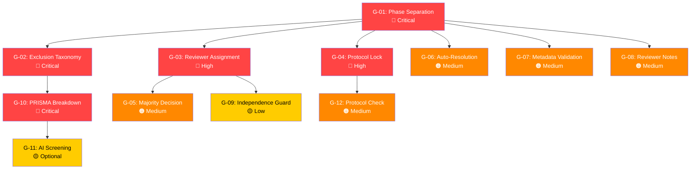

# GAP Analysis: Title–Abstract Screening

> Comparison of the **existing domain model** against the [TA.md specification](file:///d:/Capstone-project/be/SRSS/SRSS.IAM/SRSS.IAM.API/docs/specs/TA.md) (Kitchenham SLR + PRISMA 2020 compliant).

---

## 1. Entity Inventory — What Exists Today

| Entity | File | Purpose |
|---|---|---|
| [Paper](file:///d:/Capstone-project/be/SRSS/SRSS.IAM/SRSS.IAM.Repositories/Entities/Paper.cs#5-87) | [Paper.cs](file:///d:/Capstone-project/be/SRSS/SRSS.IAM/SRSS.IAM.Repositories/Entities/Paper.cs) | Bibliographic metadata, import tracking, access info |
| [ScreeningDecision](file:///d:/Capstone-project/be/SRSS/SRSS.IAM/SRSS.IAM.Repositories/Entities/ScreeningDecision.cs#9-22) | [ScreeningDecision.cs](file:///d:/Capstone-project/be/SRSS/SRSS.IAM/SRSS.IAM.Repositories/Entities/ScreeningDecision.cs) | Individual reviewer decision (Include/Exclude) |
| [ScreeningResolution](file:///d:/Capstone-project/be/SRSS/SRSS.IAM/SRSS.IAM.Repositories/Entities/ScreeningResolution.cs#9-22) | [ScreeningResolution.cs](file:///d:/Capstone-project/be/SRSS/SRSS.IAM/SRSS.IAM.Repositories/Entities/ScreeningResolution.cs) | Leader's final conflict-resolution decision |
| [StudySelectionProcess](file:///d:/Capstone-project/be/SRSS/SRSS.IAM/SRSS.IAM.Repositories/Entities/StudySelectionProcess.cs#8-56) | [StudySelectionProcess.cs](file:///d:/Capstone-project/be/SRSS/SRSS.IAM/SRSS.IAM.Repositories/Entities/StudySelectionProcess.cs) | Overall screening phase lifecycle |
| [ReviewProcess](file:///d:/Capstone-project/be/SRSS/SRSS.IAM/SRSS.IAM.Repositories/Entities/ReviewProcess.cs#5-144) | [ReviewProcess.cs](file:///d:/Capstone-project/be/SRSS/SRSS.IAM/SRSS.IAM.Repositories/Entities/ReviewProcess.cs) | Top-level review lifecycle (phases) |
| [ReviewProtocol](file:///d:/Capstone-project/be/SRSS/SRSS.IAM/SRSS.IAM.Repositories/Entities/ReviewProtocol.cs#10-153) | [ReviewProtocol.cs](file:///d:/Capstone-project/be/SRSS/SRSS.IAM/SRSS.IAM.Repositories/Entities/ReviewProtocol.cs) | Protocol with versioning & approval |
| [StudySelectionCriteria](file:///d:/Capstone-project/be/SRSS/SRSS.IAM/SRSS.IAM.Repositories/Entities/StudySelectionCriteria.cs#10-20) | [StudySelectionCriteria.cs](file:///d:/Capstone-project/be/SRSS/SRSS.IAM/SRSS.IAM.Repositories/Entities/StudySelectionCriteria.cs) | Container for inclusion/exclusion criteria |
| [InclusionCriterion](file:///d:/Capstone-project/be/SRSS/SRSS.IAM/SRSS.IAM.Repositories/Entities/InclusionCriterion.cs#10-18) | [InclusionCriterion.cs](file:///d:/Capstone-project/be/SRSS/SRSS.IAM/SRSS.IAM.Repositories/Entities/InclusionCriterion.cs) | Single inclusion rule |
| [ExclusionCriterion](file:///d:/Capstone-project/be/SRSS/SRSS.IAM/SRSS.IAM.Repositories/Entities/ExclusionCriterion.cs#10-18) | [ExclusionCriterion.cs](file:///d:/Capstone-project/be/SRSS/SRSS.IAM/SRSS.IAM.Repositories/Entities/ExclusionCriterion.cs) | Single exclusion rule |
| [ResearchQuestion](file:///d:/Capstone-project/be/SRSS/SRSS.IAM/SRSS.IAM.Repositories/Entities/ResearchQuestion.cs#10-22) | [ResearchQuestion.cs](file:///d:/Capstone-project/be/SRSS/SRSS.IAM/SRSS.IAM.Repositories/Entities/ResearchQuestion.cs) | Research question with PICOC link |
| [PicocElement](file:///d:/Capstone-project/be/SRSS/SRSS.IAM/SRSS.IAM.Repositories/Entities/PicocElement.cs#10-24) | [PicocElement.cs](file:///d:/Capstone-project/be/SRSS/SRSS.IAM/SRSS.IAM.Repositories/Entities/PicocElement.cs) | PICOC dimension (P/I/C/O/C) |

---

## 2. GAP Analysis by Spec Section

### 2.1 Screening Phase Distinction (TA Spec §1, §10)

| Requirement | Status | Detail |
|---|---|---|
| Separate TA screening from Full-Text screening | 🔴 **GAP** | [StudySelectionProcess](file:///d:/Capstone-project/be/SRSS/SRSS.IAM/SRSS.IAM.Repositories/Entities/StudySelectionProcess.cs#8-56) is a **single, monolithic entity** with no `ScreeningPhase` discriminator (e.g., `TitleAbstract` vs `FullText`). Both phases share the same [ScreeningDecision](file:///d:/Capstone-project/be/SRSS/SRSS.IAM/SRSS.IAM.Repositories/Entities/ScreeningDecision.cs#9-22) / [ScreeningResolution](file:///d:/Capstone-project/be/SRSS/SRSS.IAM/SRSS.IAM.Repositories/Entities/ScreeningResolution.cs#9-22) tables. The spec mandates two distinct phases: Phase 1 (Title/Abstract) → Phase 2 (Full-Text). |
| TA-screened "Include" papers feed into Full-Text screening | 🔴 **GAP** | No mechanism to snapshot/promote papers between phases. |

> [!IMPORTANT]
> This is the **most critical structural gap**. Without a phase discriminator, TA decisions and Full-Text decisions are indistinguishable in the database. Options:
> - Add a `ScreeningPhase` enum + FK on [ScreeningDecision](file:///d:/Capstone-project/be/SRSS/SRSS.IAM/SRSS.IAM.Repositories/Entities/ScreeningDecision.cs#9-22) and [ScreeningResolution](file:///d:/Capstone-project/be/SRSS/SRSS.IAM/SRSS.IAM.Repositories/Entities/ScreeningResolution.cs#9-22)
> - Or introduce separate `TitleAbstractScreening` / `FullTextScreening` child entities

---

### 2.2 Exclusion Reason Taxonomy (TA Spec §5)

| Requirement | Status | Detail |
|---|---|---|
| Standardized exclusion reason codes (E1–E8) | 🔴 **GAP** | `ScreeningDecision.Reason` is a free-text `string?`. No `ExclusionReason` entity or enum exists to enforce the taxonomy (`E1` Not relevant to topic, `E2` Not relevant population, etc.). |
| Exclusion reasons used for PRISMA breakdown | 🔴 **GAP** | Without structured reasons, aggregating exclusion breakdown statistics is unreliable. |

> [!WARNING]
> Free-text reasons make PRISMA reporting (§8) impossible to automate. A structured `ExclusionReasonCode` enum or lookup entity is essential.

---

### 2.3 Reviewer Assignment & Constraints (TA Spec §4, §6)

| Requirement | Status | Detail |
|---|---|---|
| Min 2 / max 3 reviewers per paper | 🔴 **GAP** | No `ReviewerAssignment` entity exists. No configuration for min/max reviewers. The service doesn't enforce reviewer count before auto-resolving. |
| Independent screening (reviewer cannot see others' decisions) | 🟡 **PARTIAL** | [SubmitScreeningDecisionAsync](file:///d:/Capstone-project/be/SRSS/SRSS.IAM/SRSS.IAM.Services/StudySelectionService/StudySelectionService.cs#185-245) prevents duplicate decisions, but there is no API-level guard that prevents fetching another reviewer's decision before submitting. [GetDecisionsByPaper](file:///d:/Capstone-project/be/SRSS/SRSS.IAM/SRSS.IAM.API/Controllers/StudySelectionController.cs#100-112) is available to anyone. |
| Decision immutability after submit | 🟢 **EXISTS** | [SubmitScreeningDecisionAsync](file:///d:/Capstone-project/be/SRSS/SRSS.IAM/SRSS.IAM.Services/StudySelectionService/StudySelectionService.cs#185-245) checks for existing decision and throws if duplicate. No update endpoint exists. |

---

### 2.4 Conflict Detection & Resolution (TA Spec §7, §8, §9)

| Requirement | Status | Detail |
|---|---|---|
| Automatic conflict detection (disagreement) | 🟢 **EXISTS** | `GetPapersWithConflictsAsync` in repository + [GetConflictedPapersAsync](file:///d:/Capstone-project/be/SRSS/SRSS.IAM/SRSS.IAM.Services/StudySelectionService/StudySelectionService.cs#270-318) in service. |
| Leader conflict resolution | 🟢 **EXISTS** | [ResolveConflictAsync](file:///d:/Capstone-project/be/SRSS/SRSS.IAM/SRSS.IAM.Services/StudySelectionService/StudySelectionService.cs#319-357) creates [ScreeningResolution](file:///d:/Capstone-project/be/SRSS/SRSS.IAM/SRSS.IAM.Repositories/Entities/ScreeningResolution.cs#9-22). |
| Majority decision (3 reviewers) | 🔴 **GAP** | No majority-vote logic. The system only detects "distinct decisions > 1" as conflict but doesn't auto-resolve 2-vs-1 scenarios. |
| Auto-resolution for unanimous decisions | 🟡 **PARTIAL** | Status determination logic in [GetPaperSelectionStatusAsync](file:///d:/Capstone-project/be/SRSS/SRSS.IAM/SRSS.IAM.Services/StudySelectionService/StudySelectionService.cs#358-399) treats unanimous Include/Exclude correctly, but no explicit [ScreeningResolution](file:///d:/Capstone-project/be/SRSS/SRSS.IAM/SRSS.IAM.Repositories/Entities/ScreeningResolution.cs#9-22) is created for unanimous outcomes — the "final decision" is only computed at runtime. |

---

### 2.5 Protocol Lock (TA Spec §6 — Step 1)

| Requirement | Status | Detail |
|---|---|---|
| Protocol must be locked once screening starts | 🔴 **GAP** | [ReviewProtocol](file:///d:/Capstone-project/be/SRSS/SRSS.IAM/SRSS.IAM.Repositories/Entities/ReviewProtocol.cs#10-153) has `ProtocolStatus.Approved` but no `Locked` state. [CanEdit()](file:///d:/Capstone-project/be/SRSS/SRSS.IAM/SRSS.IAM.Repositories/Entities/ReviewProtocol.cs#148-152) returns `true` for `Draft` status, but nothing prevents editing an `Approved` protocol after screening starts. |
| Protocol finalized before screening | 🟡 **PARTIAL** | `ReviewProcess.EnsureCanCreateStudySelectionProcess()` checks `IdentificationProcess.Completed` but does **not** check `Protocol.Status == Approved`. The TODO comment on line 38 of [ReviewProcess.cs](file:///d:/Capstone-project/be/SRSS/SRSS.IAM/SRSS.IAM.Repositories/Entities/ReviewProcess.cs) confirms this is deferred. |

---

### 2.6 Data Preparation Validation (TA Spec §6 — Step 3)

| Requirement | Status | Detail |
|---|---|---|
| Metadata validation (Title, Abstract, Year, Language required) | 🔴 **GAP** | No validation that papers entering screening have minimum required metadata. `Paper.Abstract` and `Paper.Language` are nullable. |
| Papers imported & duplicates removed | 🟢 **EXISTS** | [GetEligiblePapersAsync](file:///d:/Capstone-project/be/SRSS/SRSS.IAM/SRSS.IAM.Services/StudySelectionService/StudySelectionService.cs#145-184) uses `IdentificationProcessPapers.GetIncludedPaperIdsByProcessAsync` which is the frozen post-dedup snapshot. |

---

### 2.7 AI-Assisted Screening (TA Spec §7)

| Requirement | Status | Detail |
|---|---|---|
| AI suggested decision | 🔴 **GAP** | No entity or service for AI suggestions. |
| Relevance score (0.0–1.0) | 🔴 **GAP** | No `RelevanceScore` field on [ScreeningDecision](file:///d:/Capstone-project/be/SRSS/SRSS.IAM/SRSS.IAM.Repositories/Entities/ScreeningDecision.cs#9-22) or a separate `AIScreeningSuggestion` entity. |
| Confidence score | 🔴 **GAP** | Same as above. |
| PICOC comparison (Match/Partial/Unknown) | 🔴 **GAP** | No comparison result entity. |
| Keyword highlighting | 🔴 **GAP** | No highlighting data stored or returned. |
| Manual activation toggle | 🔴 **GAP** | No configuration for enabling/disabling AI per project. |

> [!NOTE]
> The spec marks this as **optional**. It can be deferred to a later iteration but should be designed for in the entity model.

---

### 2.8 PRISMA Reporting (TA Spec §8)

| Requirement | Status | Detail |
|---|---|---|
| Records screened (title/abstract) count | 🟡 **PARTIAL** | [SelectionStatisticsResponse](file:///d:/Capstone-project/be/SRSS/SRSS.IAM/SRSS.IAM.Services/DTOs/StudySelection/StudySelectionDto.cs#121-131) has `TotalPapers`, `IncludedCount`, `ExcludedCount` but no phase-level breakdown. |
| Exclusion reason breakdown (e.g., "Not relevant topic: 400") | 🔴 **GAP** | Cannot aggregate by reason because `ScreeningDecision.Reason` is free-text. |
| PRISMA flow diagram data | 🟡 **PARTIAL** | `PrismaReport` entity exists on [ReviewProcess](file:///d:/Capstone-project/be/SRSS/SRSS.IAM/SRSS.IAM.Repositories/Entities/ReviewProcess.cs#5-144) but its structure was not examined in detail. The TA-level stats feed into this report. |

---

### 2.9 Audit Trail (TA Spec §9)

| Requirement | Status | Detail |
|---|---|---|
| Paper ID, Reviewer ID, Decision, Timestamp | 🟢 **EXISTS** | [ScreeningDecision](file:///d:/Capstone-project/be/SRSS/SRSS.IAM/SRSS.IAM.Repositories/Entities/ScreeningDecision.cs#9-22) captures all of these. |
| Exclusion reason | 🟡 **PARTIAL** | Stored as free-text `Reason`, not structured. |
| Reviewer notes | 🔴 **GAP** | No separate `ReviewerNotes` field. `Reason` doubles as notes. The spec distinguishes "Exclusion reason" from "Reviewer notes (optional)". |
| AI suggestion (if used) | 🔴 **GAP** | No AI suggestion entity linked to the decision audit trail. |

---

### 2.10 Screening Decision Enum Completeness (TA Spec §3, §5)

| Requirement | Status | Detail |
|---|---|---|
| Decision types: Include, Exclude | 🟢 **EXISTS** | `ScreeningDecisionType { Include = 0, Exclude = 1 }` |
| Missing: "Maybe" / "Uncertain" decision | 🟡 **OPTIONAL** | Spec does not explicitly require it, but Kitchenham methodology sometimes includes an "Uncertain" category for borderline papers. Not a gap per-spec, but a design consideration. |

---

## 3. Summary Matrix

| # | Spec Requirement | Severity | Status |
|---|---|---|---|
| G-01 | TA vs Full-Text phase separation | 🔴 Critical | Missing |
| G-02 | Structured exclusion reason taxonomy (E1–E8) | 🔴 Critical | Missing |
| G-03 | Reviewer assignment (min 2 / max 3) | 🔴 High | Missing |
| G-04 | Protocol lock on screening start | 🔴 High | Missing |
| G-05 | Majority decision logic (3 reviewers) | 🟠 Medium | Missing |
| G-06 | Auto-create resolution for unanimous decisions | 🟠 Medium | Missing |
| G-07 | Paper metadata validation before screening | 🟠 Medium | Missing |
| G-08 | Reviewer notes (separate from reason) | 🟠 Medium | Missing |
| G-09 | Independent screening guard (API-level) | 🟡 Low | Partial |
| G-10 | PRISMA exclusion reason breakdown | 🔴 Critical | Missing (blocked by G-02) |
| G-11 | AI-assisted screening entities | 🟡 Low | Missing (optional) |
| G-12 | Protocol approval check before screening | 🟠 Medium | Deferred (TODO in code) |

---

## 4. Existing Strengths

The following areas are **well-implemented** and align with the spec:

- ✅ **Decision submission idempotency** — duplicate decision prevention
- ✅ **Conflict detection** — distinct decision count check
- ✅ **Conflict resolution** — leader resolution with notes
- ✅ **Post-dedup paper sourcing** — frozen `IdentificationProcessPaper` snapshot
- ✅ **Pagination & filtering** — [PapersWithDecisionsRequest](file:///d:/Capstone-project/be/SRSS/SRSS.IAM/SRSS.IAM.Services/DTOs/StudySelection/StudySelectionDto.cs#29-37) supports search, status filter, sort
- ✅ **Process lifecycle** — `NotStarted → InProgress → Completed` state machine
- ✅ **Rich paper metadata** — bibliographic fields fully support TA screening input requirements
- ✅ **PICOC framework** — [PicocElement](file:///d:/Capstone-project/be/SRSS/SRSS.IAM/SRSS.IAM.Repositories/Entities/PicocElement.cs#10-24) entity with full P/I/C/O/C breakdown
- ✅ **Inclusion/Exclusion criteria** — structured in protocol via [StudySelectionCriteria](file:///d:/Capstone-project/be/SRSS/SRSS.IAM/SRSS.IAM.Repositories/Entities/StudySelectionCriteria.cs#10-20)

---

## 5. Recommended Implementation Priority

### Phase 1 — Structural Foundation
1. **G-01**: Add `ScreeningPhase` enum + discriminator
2. **G-02**: Create `ExclusionReasonCode` enum or entity
3. **G-04**: Add protocol lock mechanism

### Phase 2 — Reviewer Workflow
4. **G-03**: Create `ReviewerAssignment` entity & constraints
5. **G-05**: Implement majority decision logic
6. **G-06**: Auto-persist [ScreeningResolution](file:///d:/Capstone-project/be/SRSS/SRSS.IAM/SRSS.IAM.Repositories/Entities/ScreeningResolution.cs#9-22) for unanimous outcomes
7. **G-09**: API-level independence guard

### Phase 3 — Data Quality & Reporting
8. **G-07**: Paper metadata validation service
9. **G-08**: Add `ReviewerNotes` to [ScreeningDecision](file:///d:/Capstone-project/be/SRSS/SRSS.IAM/SRSS.IAM.Repositories/Entities/ScreeningDecision.cs#9-22)
10. **G-10**: PRISMA exclusion-reason aggregation query
11. **G-12**: Enforce protocol approval check

### Phase 4 — AI Enhancement (Optional)
12. **G-11**: `AIScreeningSuggestion` entity + service
