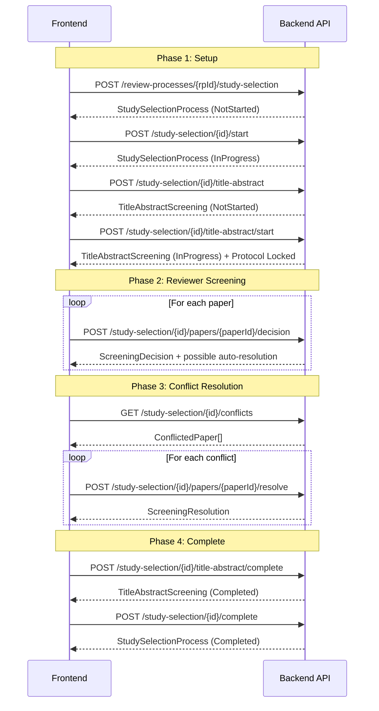

# Study Selection & Title-Abstract Screening API Documentation

> **Base URL**: `/api`
> **Auth**: Bearer JWT token required in `Authorization` header for all endpoints.

---

## Table of Contents

1. [Enums & Constants](#enums--constants)
2. [TypeScript Interfaces](#typescript-interfaces)
3. [Study Selection Process Lifecycle](#study-selection-process-lifecycle)
4. [Title-Abstract Screening Lifecycle](#title-abstract-screening-lifecycle)
5. [Screening Decision & Conflict Resolution](#screening-decision--conflict-resolution)
6. [Papers & Statistics](#papers--statistics)
7. [Workflow Diagram](#workflow-diagram)
8. [Example API Calls (Axios)](#example-api-calls-axios)

---

## Enums & Constants

```typescript
// Screening decision made by a reviewer
enum ScreeningDecisionType {
  Include = 0,
  Exclude = 1
}

// Which screening phase a decision belongs to
enum ScreeningPhase {
  TitleAbstract = 0,
  FullText = 1
}

// Lifecycle status of a screening phase (TA or FT)
enum ScreeningPhaseStatus {
  NotStarted = 0,
  InProgress = 1,
  Completed = 2
}

// Overall study selection process status
enum SelectionProcessStatus {
  NotStarted = 0,
  InProgress = 1,
  Completed = 2
}

// Computed paper status (not stored, derived at runtime)
enum PaperSelectionStatus {
  Pending = 0,    // No decisions yet
  Included = 1,   // Unanimously included OR resolved as included
  Excluded = 2,   // Unanimously excluded OR resolved as excluded
  Conflict = 3,   // Reviewers disagree (Include vs Exclude)
  Resolved = 4    // Conflict was manually resolved
}

// Sort options for paper listing
enum PaperSortBy {
  TitleAsc = 0,
  TitleDesc = 1,
  YearNewest = 2,
  YearOldest = 3
}

// PRISMA-compliant exclusion reason codes (required when decision = Exclude)
enum ExclusionReasonCode {
  NotRelevantToTopic = 0,
  NotRelevantPopulation = 1,
  NotRelevantIntervention = 2,
  NotEmpiricalStudy = 3,
  NotResearchPaper = 4,
  OutsideTimeRange = 5,
  UnsupportedLanguage = 6,
  DuplicateStudy = 7,
  Other = 99
}
```

---

## TypeScript Interfaces

### Wrapper Response

All API responses are wrapped in:

```typescript
interface ApiResponse<T> {
  isSuccess: boolean;
  message: string;
  data: T | null;
  errors: string[] | null;
}
```

### Request DTOs

```typescript
interface CreateStudySelectionProcessRequest {
  notes?: string;                    // Optional notes
  // reviewProcessId is set from route param — do NOT include in body
}

interface SubmitScreeningDecisionRequest {
  reviewerId: string;                // Required: GUID of the reviewer
  decision: ScreeningDecisionType;   // Required: 0 = Include, 1 = Exclude
  reason?: string;                   // Optional: free-text reason
  exclusionReasonCode?: ExclusionReasonCode; // Required when decision = Exclude
  reviewerNotes?: string;            // Optional: private notes for the reviewer
}

interface ResolveScreeningConflictRequest {
  finalDecision: ScreeningDecisionType; // Required: 0 = Include, 1 = Exclude
  resolvedBy: string;                   // Required: GUID of the resolver
  resolutionNotes?: string;             // Optional: explanation for the resolution
}
```

### Response DTOs

```typescript
interface StudySelectionProcessResponse {
  id: string;
  reviewProcessId: string;
  notes: string | null;
  startedAt: string | null;        // ISO 8601
  completedAt: string | null;
  status: SelectionProcessStatus;
  statusText: string;              // "NotStarted" | "InProgress" | "Completed"
  createdAt: string;
  modifiedAt: string;
  selectionStatistics: SelectionStatisticsResponse;
  titleAbstractScreening: TitleAbstractScreeningResponse | null;
}

interface TitleAbstractScreeningResponse {
  id: string;
  studySelectionProcessId: string;
  status: ScreeningPhaseStatus;
  statusText: string;              // "NotStarted" | "InProgress" | "Completed"
  startedAt: string | null;
  completedAt: string | null;
  minReviewersPerPaper: number;    // Default: 2
  maxReviewersPerPaper: number;    // Default: 3
  createdAt: string;
  modifiedAt: string;
}

interface ScreeningDecisionResponse {
  id: string;
  studySelectionProcessId: string;
  paperId: string;
  paperTitle: string;
  reviewerId: string;
  reviewerName: string;
  decision: ScreeningDecisionType;
  decisionText: string;            // "Include" | "Exclude"
  phase: ScreeningPhase;
  phaseText: string;               // "TitleAbstract" | "FullText"
  exclusionReasonCode: ExclusionReasonCode | null;
  reason: string | null;
  reviewerNotes: string | null;
  decidedAt: string;
}

interface ScreeningResolutionResponse {
  id: string;
  studySelectionProcessId: string;
  paperId: string;
  paperTitle: string;
  finalDecision: ScreeningDecisionType;
  finalDecisionText: string;
  phase: ScreeningPhase;
  phaseText: string;
  resolutionNotes: string | null;
  resolvedBy: string;              // GUID — "00000000-..." means auto-resolved by system
  resolverName: string;
  resolvedAt: string;
}

interface PaperWithDecisionsResponse {
  paperId: string;
  title: string;
  doi: string | null;
  authors: string | null;
  publicationYear: number | null;
  abstract: string | null;
  journal: string | null;
  source: string | null;
  keywords: string | null;
  publicationType: string | null;
  volume: string | null;
  issue: string | null;
  pages: string | null;
  publisher: string | null;
  language: string | null;
  url: string | null;
  pdfUrl: string | null;
  conferenceName: string | null;
  conferenceLocation: string | null;
  journalIssn: string | null;
  status: PaperSelectionStatus;
  statusText: string;
  decisions: ScreeningDecisionResponse[];
  resolution: ScreeningResolutionResponse | null;
}

interface ConflictedPaperResponse {
  paperId: string;
  title: string;
  doi: string | null;
  conflictingDecisions: ScreeningDecisionResponse[];
}

interface SelectionStatisticsResponse {
  studySelectionProcessId: string;
  totalPapers: number;
  includedCount: number;
  excludedCount: number;
  conflictCount: number;
  pendingCount: number;
  completionPercentage: number;    // e.g. 75.50
  exclusionReasonBreakdown: ExclusionReasonBreakdownItem[];
}

interface ExclusionReasonBreakdownItem {
  reasonCode: ExclusionReasonCode;
  reasonText: string;              // e.g. "NotRelevantToTopic"
  count: number;
}

interface PaginatedResponse<T> {
  items: T[];
  totalCount: number;
  pageNumber: number;
  pageSize: number;
  totalPages: number;
}
```

---

## Study Selection Process Lifecycle

### 1. Create Study Selection Process

| | |
|---|---|
| **Method** | `POST` |
| **Route** | `/api/review-processes/{reviewProcessId}/study-selection` |
| **Purpose** | Create a new study selection process linked to a review process |

**Path Params**: `reviewProcessId` (GUID) — the parent review process

**Request Body**:
```json
{
  "notes": "Optional description"
}
```

**Success**: `201 Created` → `ApiResponse<StudySelectionProcessResponse>`

**Business Logic**:
- Validates the review process exists
- Enforces domain rule: only one study selection process per review process
- Identification process must be completed first
- Initial status = `NotStarted`

**Validation Errors** (400):
- Review process not found
- Study selection already exists for this review process
- Identification not completed

---

### 2. Get Study Selection Process

| | |
|---|---|
| **Method** | `GET` |
| **Route** | `/api/study-selection/{id}` |
| **Purpose** | Retrieve process details with statistics and TA screening info |

**Success**: `200 OK` → `ApiResponse<StudySelectionProcessResponse>`

**⚠️ FE Note**: This returns **embedded** `selectionStatistics` and `titleAbstractScreening` — no separate calls needed for overview.

---

### 3. Start Study Selection Process

| | |
|---|---|
| **Method** | `POST` |
| **Route** | `/api/study-selection/{id}/start` |
| **Purpose** | Transition process from NotStarted → InProgress |

**Success**: `200 OK` → `ApiResponse<StudySelectionProcessResponse>`

**Business Logic**:
- Validates identification process is completed
- Transitions status: `NotStarted` → `InProgress`

**Validation Errors** (400):
- Process not found
- Cannot start from current status (not `NotStarted`)

---

### 4. Complete Study Selection Process

| | |
|---|---|
| **Method** | `POST` |
| **Route** | `/api/study-selection/{id}/complete` |
| **Purpose** | Finalize the study selection process |

**Success**: `200 OK` → `ApiResponse<StudySelectionProcessResponse>`

**Business Logic**:
- **Blocks** if any unresolved conflicts exist
- Transitions status: `InProgress` → `Completed`

**⚠️ FE Note**: Show conflict count before enabling the "Complete" button. Call `/conflicts` endpoint to check.

---

## Title-Abstract Screening Lifecycle

### 5. Create TA Screening

| | |
|---|---|
| **Method** | `POST` |
| **Route** | `/api/study-selection/{id}/title-abstract` |
| **Purpose** | Initialize the TA screening phase for a study selection process |

**Path Params**: `id` (GUID) — the study selection process ID

**Request Body**: None

**Success**: `201 Created` → `ApiResponse<TitleAbstractScreeningResponse>`

**Business Logic**:
- Only **one** TA screening per process (idempotency guard)
- Initial status = `NotStarted`
- Default reviewer config: min=2, max=3

**Validation Errors** (400):
- Process not found
- TA screening already exists

---

### 6. Start TA Screening

| | |
|---|---|
| **Method** | `POST` |
| **Route** | `/api/study-selection/{id}/title-abstract/start` |
| **Purpose** | Start the TA screening phase (activates paper screening) |

**Success**: `200 OK` → `ApiResponse<TitleAbstractScreeningResponse>`

**Business Logic**:
- **Side Effect**: If the review protocol is `Approved`, it gets **locked** (status → `Locked`). Protocol can no longer be edited after this point.
- Validates paper metadata (Title, Abstract, Year, Language) — warnings are collected but do **not** block the start
- Transitions status: `NotStarted` → `InProgress`

> [!IMPORTANT]
> **Protocol Lock**: Once TA screening starts, the protocol becomes read-only. Warn the user before starting.

**Validation Errors** (400):
- TA screening not found (must create first)
- Cannot start from current status (not `NotStarted`)

---

### 7. Complete TA Screening

| | |
|---|---|
| **Method** | `POST` |
| **Route** | `/api/study-selection/{id}/title-abstract/complete` |
| **Purpose** | Mark TA screening as completed |

**Success**: `200 OK` → `ApiResponse<TitleAbstractScreeningResponse>`

**Business Logic**:
- **Blocks** if any unresolved conflicts remain in the TA phase
- Transitions status: `InProgress` → `Completed`

**Validation Errors** (400):
- TA screening not found
- Cannot complete with unresolved conflicts (error message includes count)

**⚠️ FE Note**: Check `/conflicts` before enabling the "Complete TA" button.

---

### 8. Get TA Screening Status

| | |
|---|---|
| **Method** | `GET` |
| **Route** | `/api/study-selection/{id}/title-abstract` |
| **Purpose** | Get current TA screening status and configuration |

**Success**: `200 OK` → `ApiResponse<TitleAbstractScreeningResponse>`

---

## Screening Decision & Conflict Resolution

### 9. Submit Screening Decision

| | |
|---|---|
| **Method** | `POST` |
| **Route** | `/api/study-selection/{id}/papers/{paperId}/decision` |
| **Purpose** | Submit a reviewer's Include/Exclude decision for a paper |

**Path Params**: `id` (GUID), `paperId` (GUID)

**Request Body**:
```json
{
  "reviewerId": "guid-of-reviewer",
  "decision": 1,
  "exclusionReasonCode": 0,
  "reason": "Not relevant to research question",
  "reviewerNotes": "Private notes"
}
```

**Validation Rules**:
| Field | Rule |
|-------|------|
| `reviewerId` | Required, must be a valid GUID |
| `decision` | Required: `0` = Include, `1` = Exclude |
| `exclusionReasonCode` | **Required when `decision = 1` (Exclude)**. Error if missing. |
| `reason` | Optional free-text |
| `reviewerNotes` | Optional private notes |

**Success**: `201 Created` → `ApiResponse<ScreeningDecisionResponse>`

**Business Logic**:
1. **Idempotent**: One decision per reviewer per paper. Duplicate submission returns error.
2. **Phase**: All decisions are tagged with `Phase = TitleAbstract` (hardcoded currently).
3. **Auto-Resolution** (happens automatically after submission):
   - If all reviewers agree (≥ `minReviewersPerPaper`): auto-creates a `ScreeningResolution` with `resolvedBy = "00000000-0000-0000-0000-000000000000"` (system).
   - **Unanimous**: 2/2 Include → auto-Include. 2/2 Exclude → auto-Exclude.
   - **Majority** (3+ reviewers): 2/3 Include → auto-Include. 2/3 Exclude → auto-Exclude.
   - If decisions are split (e.g., 1 Include + 1 Exclude with 2 reviewers) → **no auto-resolution**, paper shows as `Conflict`.

> [!IMPORTANT]
> After submitting a decision, the FE should **re-fetch** the paper status or check the response — the paper might have been auto-resolved by the system.

**Validation Errors** (400):
- Process not found
- Paper not found
- Reviewer already submitted a decision for this paper
- `ExclusionReasonCode` missing when decision is Exclude

---

### 10. Get Decisions by Paper

| | |
|---|---|
| **Method** | `GET` |
| **Route** | `/api/study-selection/{id}/papers/{paperId}/decisions` |
| **Purpose** | Get all reviewer decisions for a specific paper |

**Success**: `200 OK` → `ApiResponse<ScreeningDecisionResponse[]>`

---

### 11. Get Conflicted Papers

| | |
|---|---|
| **Method** | `GET` |
| **Route** | `/api/study-selection/{id}/conflicts` |
| **Purpose** | Get all papers with unresolved conflicts (only unresolved) |

**Success**: `200 OK` → `ApiResponse<ConflictedPaperResponse[]>`

**Business Logic**: Returns only papers where reviewers disagree AND no resolution exists yet. Papers resolved by auto-resolution (unanimous/majority) will NOT appear here.

---

### 12. Resolve Conflict

| | |
|---|---|
| **Method** | `POST` |
| **Route** | `/api/study-selection/{id}/papers/{paperId}/resolve` |
| **Purpose** | Manually resolve a conflicted paper with a final decision |

**Request Body**:
```json
{
  "finalDecision": 0,
  "resolvedBy": "guid-of-resolver",
  "resolutionNotes": "Included after discussion with team"
}
```

**Success**: `201 Created` → `ApiResponse<ScreeningResolutionResponse>`

**Validation Errors** (400):
- Resolution already exists for this paper (no double resolution)

---

## Papers & Statistics

### 13. Get Eligible Papers

| | |
|---|---|
| **Method** | `GET` |
| **Route** | `/api/study-selection/{id}/eligible-papers` |
| **Purpose** | Get IDs of all papers eligible for screening (post-deduplication) |

**Success**: `200 OK` → `ApiResponse<string[]>` (array of GUIDs)

**Business Logic**: Returns papers from the identification process snapshot that were included (non-duplicates).

---

### 14. Get Paper Selection Status

| | |
|---|---|
| **Method** | `GET` |
| **Route** | `/api/study-selection/{id}/papers/{paperId}/status` |
| **Purpose** | Get the computed status of a single paper |

**Success**: `200 OK` → `ApiResponse<PaperSelectionStatus>` (integer: 0-4)

---

### 15. Get Selection Statistics

| | |
|---|---|
| **Method** | `GET` |
| **Route** | `/api/study-selection/{id}/statistics` |
| **Purpose** | Get PRISMA-ready statistics with exclusion reason breakdown |

**Success**: `200 OK` → `ApiResponse<SelectionStatisticsResponse>`

**Response Example**:
```json
{
  "data": {
    "studySelectionProcessId": "...",
    "totalPapers": 150,
    "includedCount": 45,
    "excludedCount": 80,
    "conflictCount": 5,
    "pendingCount": 20,
    "completionPercentage": 86.67,
    "exclusionReasonBreakdown": [
      { "reasonCode": 0, "reasonText": "NotRelevantToTopic", "count": 35 },
      { "reasonCode": 3, "reasonText": "NotEmpiricalStudy", "count": 25 },
      { "reasonCode": 6, "reasonText": "UnsupportedLanguage", "count": 20 }
    ]
  }
}
```

---

### 16. Get Papers with Decisions (Paginated)

| | |
|---|---|
| **Method** | `GET` |
| **Route** | `/api/study-selection/{id}/papers` |
| **Purpose** | Paginated paper list with all decisions and resolution status |

**Query Params**:
| Param | Type | Default | Description |
|-------|------|---------|-------------|
| `search` | string | null | Filter by paper title (case-insensitive) |
| `status` | int | null | Filter by `PaperSelectionStatus` (0-4) |
| `sortBy` | int | 0 | `0`=TitleAsc, `1`=TitleDesc, `2`=YearNewest, `3`=YearOldest |
| `pageNumber` | int | 1 | Page number (min: 1) |
| `pageSize` | int | 20 | Page size (min: 1, max: 100) |

**Success**: `200 OK` → `ApiResponse<PaginatedResponse<PaperWithDecisionsResponse>>`

**⚠️ FE Note**: Each paper in the response includes its `decisions[]` and optional `resolution`. Use `status` to determine the UI state (badge color, action buttons).

---

## Workflow Diagram



---

## Example API Calls (Axios)

```typescript
import axios from 'axios';

const api = axios.create({
  baseURL: '/api',
  headers: { Authorization: `Bearer ${token}` }
});

// 1. Create study selection process
const createProcess = (reviewProcessId: string, notes?: string) =>
  api.post(`/review-processes/${reviewProcessId}/study-selection`, { notes });

// 2. Start process
const startProcess = (id: string) =>
  api.post(`/study-selection/${id}/start`);

// 3. Create TA screening
const createTAScreening = (processId: string) =>
  api.post(`/study-selection/${processId}/title-abstract`);

// 4. Start TA screening (locks protocol!)
const startTAScreening = (processId: string) =>
  api.post(`/study-selection/${processId}/title-abstract/start`);

// 5. Submit decision
const submitDecision = (
  processId: string,
  paperId: string,
  body: SubmitScreeningDecisionRequest
) => api.post(`/study-selection/${processId}/papers/${paperId}/decision`, body);

// 6. Get papers (paginated)
const getPapers = (processId: string, params: {
  search?: string;
  status?: PaperSelectionStatus;
  sortBy?: PaperSortBy;
  pageNumber?: number;
  pageSize?: number;
}) => api.get(`/study-selection/${processId}/papers`, { params });

// 7. Get conflicts
const getConflicts = (processId: string) =>
  api.get(`/study-selection/${processId}/conflicts`);

// 8. Resolve conflict
const resolveConflict = (
  processId: string,
  paperId: string,
  body: ResolveScreeningConflictRequest
) => api.post(`/study-selection/${processId}/papers/${paperId}/resolve`, body);

// 9. Complete TA screening
const completeTAScreening = (processId: string) =>
  api.post(`/study-selection/${processId}/title-abstract/complete`);

// 10. Get statistics
const getStatistics = (processId: string) =>
  api.get(`/study-selection/${processId}/statistics`);
```

---

## Common Pitfalls & FE Integration Notes

| Pitfall | Solution |
|---------|----------|
| Calling "Complete" with unresolved conflicts | Check `/conflicts` first. Disable button if `conflicts.length > 0` |
| Missing `exclusionReasonCode` on Exclude | Frontend must enforce: if `decision = Exclude`, `exclusionReasonCode` is required |
| Duplicate decision submission | Backend rejects. Show "already submitted" message on 400 |
| Protocol becomes read-only after TA start | Show confirmation dialog before calling `/title-abstract/start` |
| Auto-resolved papers still showing as "Conflict" | Re-fetch paper status after submitting — auto-resolution runs server-side |
| `resolvedBy = "00000000-..."` | This means **system** auto-resolved. Show "Auto-resolved" label in UI |
| Page size > 100 | Backend caps at 100. Don't request more |
